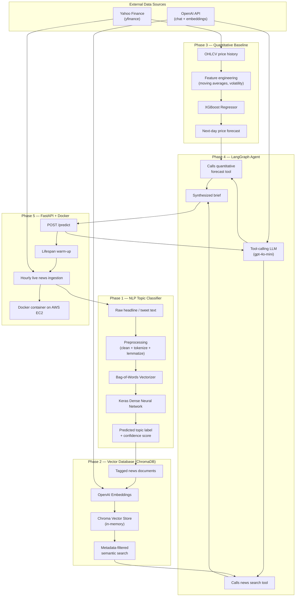
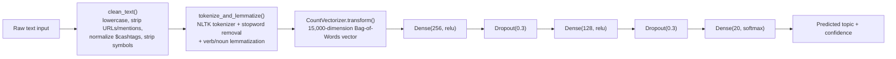
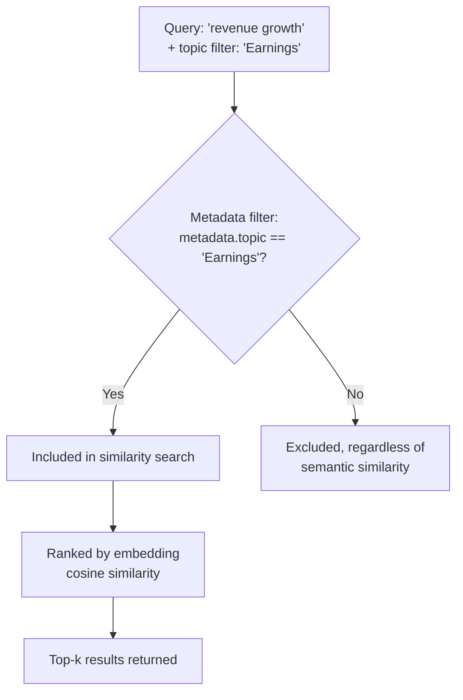
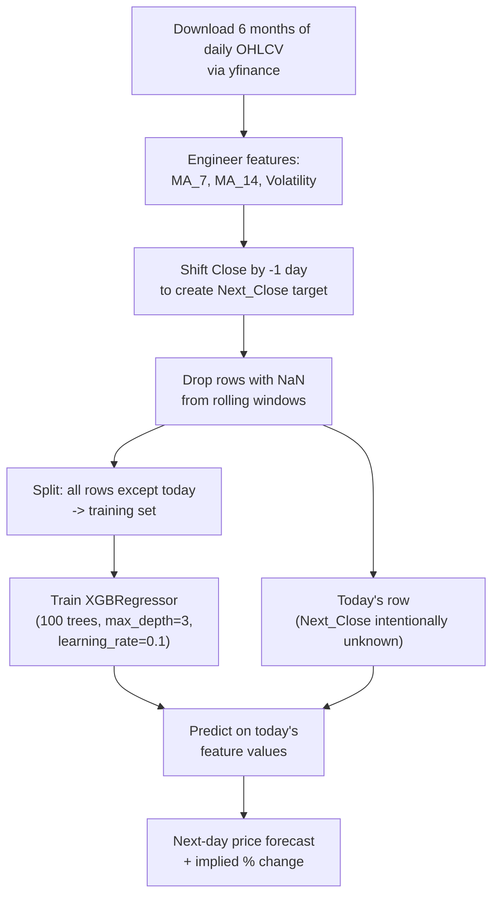
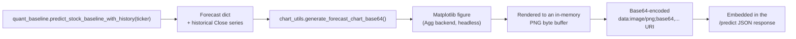
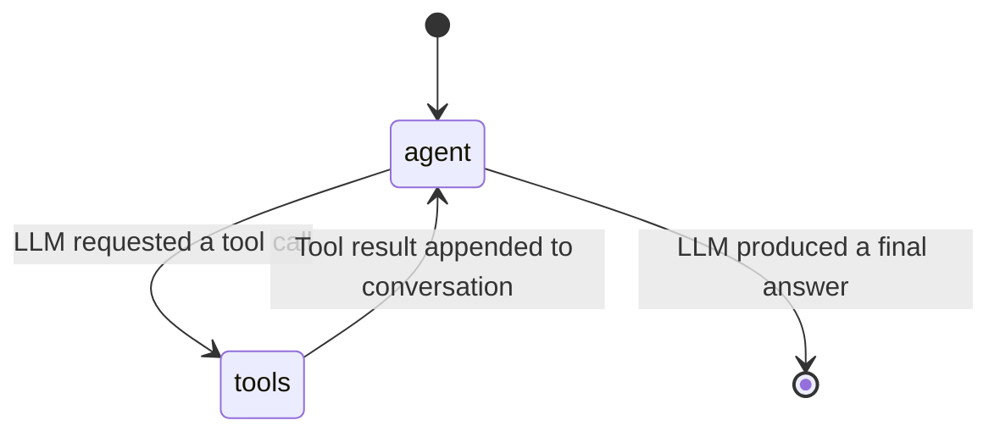
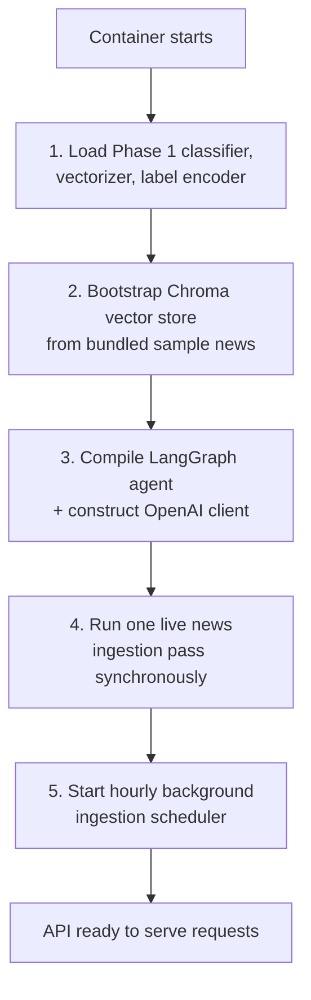
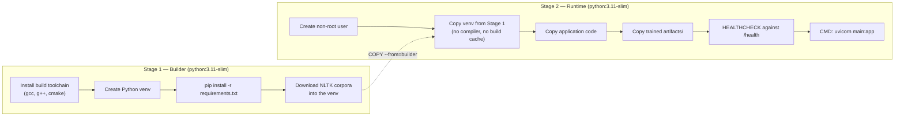

# Stock Market Predictor & Financial Intelligence Agent


Stock Market Predictor & Financial Intelligence Agent is an end-to-end system that combines a machine-learning price forecast with a natural-language understanding of current financial news, and synthesizes both into a single, readable investment brief through a tool-calling AI agent. It is built as a five-phase pipeline, deployed as a containerized API, and runs live on cloud infrastructure.

This document explains the project from first principles: what problem it addresses, why each component exists, exactly how the algorithms work, how the dataset was sourced and used, and every command required to set it up, train it, containerize it, and deploy it — written so that a reader with limited prior exposure to machine learning or cloud deployment can follow along and reproduce the system.

---

## Table of Contents

1. [Overview](#1-overview)
2. [Background and Motivation](#2-background-and-motivation)
3. [Important Disclaimer](#3-important-disclaimer)
4. [System Architecture](#4-system-architecture)
5. [Technology Stack](#5-technology-stack)
6. [Repository Structure](#6-repository-structure)
7. [Phase 1 — NLP Topic Classifier](#7-phase-1--nlp-topic-classifier)
8. [Phase 2 — Vector Database and Retrieval-Augmented Generation](#8-phase-2--vector-database-and-retrieval-augmented-generation)
9. [Phase 3 — Quantitative Baseline (XGBoost)](#9-phase-3--quantitative-baseline-xgboost)
10. [Phase 4 — Agentic Orchestration (LangGraph)](#10-phase-4--agentic-orchestration-langgraph)
11. [Phase 5 — API Layer and Containerization](#11-phase-5--api-layer-and-containerization)
12. [End-to-End Request Walkthrough](#12-end-to-end-request-walkthrough)
13. [Dataset Details](#13-dataset-details)
14. [Glossary of Key Concepts](#14-glossary-of-key-concepts)
15. [Environment Variables](#15-environment-variables)
16. [Getting Started — Local Setup From Scratch](#16-getting-started--local-setup-from-scratch)
17. [Training the NLP Classifier](#17-training-the-nlp-classifier)
18. [Running the API Locally](#18-running-the-api-locally)
19. [Containerizing with Docker](#19-containerizing-with-docker)
20. [Deploying to AWS EC2](#20-deploying-to-aws-ec2)
21. [Testing the Live API](#21-testing-the-live-api)
22. [Operational Notes and Troubleshooting](#22-operational-notes-and-troubleshooting)
23. [Limitations](#23-limitations)
24. [Roadmap and Future Work](#24-roadmap-and-future-work)
25. [License and Acknowledgments](#25-license-and-acknowledgments)

---

## 1. Overview

Stock Market Predictor & Financial Intelligence Agent answers a single question for a given stock ticker: *"What is your outlook for tomorrow?"*

It answers that question by doing three separate things and then combining them:

- Producing a **quantitative forecast** — a next-trading-day closing price prediction generated by a machine learning model trained on that ticker's recent price history.
- Retrieving **qualitative context** — recent financial news or commentary relevant to that ticker, pulled from a searchable knowledge base and filtered by topic (earnings, regulation, macroeconomics, and so on).
- **Synthesizing** both signals into a short, written brief using a large language model (LLM), which explicitly states whether the news supports or contradicts the numerical forecast.

The system is exposed as a single HTTP API endpoint (`POST /predict`), backed by a five-phase internal pipeline, packaged into a Docker container, and deployed on a live AWS EC2 instance.

---

## 2. Background and Motivation

Two well-known but separate approaches exist for reasoning about markets:

**Quantitative analysis** looks at historical numerical data — prices, volumes, moving averages, volatility — and fits a statistical or machine learning model to extrapolate a short-term trend. It is objective and reproducible, but blind to real-world events: a well-fitted price model has no way of knowing that a company just missed earnings or that a regulator just opened an investigation.

**Qualitative analysis** looks at news, commentary, and sentiment. It captures real-world context that price history alone cannot, but on its own it is difficult to translate into a specific number, and difficult to search at scale without also understanding *what kind* of news you're looking at (an "earnings" story and a "merger" story about the same company are very different signals).

The motivation behind Stock Market Predictor & Financial Intelligence Agent is to combine both in a single automated pipeline: a numerical anchor from the quantitative model, and real-world grounding from a topic-classified, semantically searchable news corpus, reconciled by a language model that can explain *why* the two might agree or disagree — rather than presenting either signal in isolation.

The project was built in five incremental phases, each one a self-contained, independently testable module, so that the system could be developed, debugged, and understood one layer at a time before being wired together.

---

## 3. Important Disclaimer

Stock Market Predictor & Financial Intelligence Agent is an educational and portfolio engineering project, not a financial product. Short-horizon stock price movements are extremely difficult to predict from historical price data alone — this is a well-established property of efficient markets, not a limitation specific to this project's model choice. The quantitative forecast in this system should be read as **one weak, noisy signal among several**, not as a reliable prediction of future price.

The system's own LLM agent is explicitly instructed (see its system prompt in [Phase 4](#10-phase-4--agentic-orchestration-langgraph)) to frame its output as analysis rather than personalized investment advice, and to avoid issuing definitive buy/sell instructions. Nothing produced by this project should be used as the sole basis for a real financial decision.

---

## 4. System Architecture

At the highest level, the system is organized into five phases. Phases 1–3 produce raw signals (a topic label, a searchable knowledge base, and a price forecast). Phase 4 is the orchestration layer that decides how and when to use those signals. Phase 5 exposes the whole thing as a web service.



**Reading the diagram:** live news headlines are pulled from Yahoo Finance, tagged with a topic by Phase 1's classifier, embedded and stored by Phase 2's vector database. When a request arrives at the API, Phase 4's agent calls Phase 3 for a numerical forecast and Phase 2 for relevant news, then writes a combined brief. Phase 5 is the container that wires all of this together and keeps it running continuously.

---

## 5. Technology Stack

| Layer | Technology | Purpose |
|---|---|---|
| Language | Python 3.11 (runtime container) | Core implementation language |
| NLP classification | TensorFlow / Keras, scikit-learn, NLTK | Topic classification model, vectorization, text preprocessing |
| Vector database | ChromaDB | In-memory semantic search over financial news |
| Embeddings | OpenAI `text-embedding-3-small` | Converts text into vectors for semantic search |
| Quantitative model | XGBoost (`XGBRegressor`) | Next-day price regression |
| Market data | yfinance | Historical and live price/news data from Yahoo Finance |
| LLM orchestration | LangChain, LangGraph | Tool-calling agent framework and state machine |
| Chat model | OpenAI `gpt-4o-mini` | Synthesizes the final financial brief |
| API framework | FastAPI, Uvicorn | HTTP service layer |
| Scheduling | APScheduler | Hourly background news ingestion |
| Containerization | Docker (multi-stage build) | Packaging and deployment |
| Cloud hosting | AWS EC2 (Amazon Linux 2023) | Live deployment target |
| Charting | Matplotlib (headless "Agg" backend) | Renders the price-history + forecast chart returned by `/predict` |

---

## 6. Repository Structure

```
StockMarketPredictor/
├── main.py                  # Phase 5 — FastAPI app, lifespan startup, live ingestion
├── nlp_router.py             # Phase 1 — preprocessing + classifier inference
├── train_classifier.py       # Phase 1 — training script (produces artifacts/)
├── vector_store.py           # Phase 2 — ChromaDB indexing and retrieval
├── quant_baseline.py         # Phase 3 — XGBoost feature engineering and forecast
├── chart_utils.py             # Phase 3 — renders the forecast chart as a base64 PNG
├── langgraph_agent.py        # Phase 4 — tool-calling agent and state graph
├── requirements.txt          # Pinned Python dependencies
├── Dockerfile                 # Multi-stage build definition
├── .env                       # Local secrets (never committed — see .gitignore)
└── artifacts/                 # Trained model files (created by train_classifier.py)
    ├── financial_topic_classifier.keras
    ├── vectorizer.pkl
    └── label_encoder.pkl
```

Each `.py` file above begins with a module-level docstring explaining its role in the pipeline — the sections below summarize and expand on those.

---

## 7. Phase 1 — NLP Topic Classifier

### 7.1 Purpose

Before any news headline can be indexed into the searchable knowledge base (Phase 2), it needs a topic label — "Earnings," "Fed / Central Banks," "M&A," and so on — so that later retrieval can be scoped to a relevant category instead of searching blindly across every unrelated headline in the corpus. Phase 1 is the model that assigns this label.

### 7.2 Algorithm: Bag-of-Words + Feedforward Neural Network

This is a classic, lightweight text classification approach chosen deliberately for its speed, interpretability, and low resource requirements (an important constraint given the project's small-instance cloud deployment target). It works in two stages:

**Stage 1 — Bag-of-Words vectorization.** Text is converted into a fixed-length numeric vector by counting how many times each word in a fixed vocabulary appears, ignoring word order. For example, with a tiny vocabulary of `["earnings", "beat", "fed", "rate"]`, the sentence "earnings beat estimates" becomes `[1, 1, 0, 0]`. This project caps the vocabulary at the 15,000 most frequent tokens (`MAX_VOCAB_SIZE = 15000` in `train_classifier.py`), using scikit-learn's `CountVectorizer`.

**Stage 2 — Dense neural network classifier.** The Bag-of-Words vector is fed through a small feedforward neural network built with Keras, which learns to map word-count patterns to one of 20 topic categories.



### 7.3 Text Preprocessing Detail

Implemented in `nlp_router.py` and reused directly (not reimplemented) by the training script, so that training and inference are guaranteed to preprocess text identically:

- **`clean_text()`** — lowercases the text, strips URLs and `@mentions`, converts cashtags such as `$AAPL` into a first-class token `ticker_aapl` (so the ticker itself becomes a learnable feature rather than being discarded), unwraps hashtags (`#earnings` → `earnings`), and removes remaining punctuation except `%` and `.` (to preserve percentages and decimals).
- **`tokenize_and_lemmatize()`** — tokenizes with NLTK's `word_tokenize`, removes English stopwords, then lemmatizes each token twice: once as a verb (so "surged" → "surge") and once as a noun (so "earnings" → "earning"), using NLTK's `WordNetLemmatizer`.

Reusing this exact pipeline for both training and inference eliminates a common and hard-to-detect bug class known as **train/serve skew**, where a model is trained on text cleaned one way but served on text cleaned a slightly different way, silently degrading real-world accuracy without ever showing up in offline evaluation.

### 7.4 Model Architecture and Training Configuration

| Parameter | Value |
|---|---|
| Input dimension | 15,000 (Bag-of-Words vocabulary size) |
| Hidden layer 1 | Dense, 256 units, ReLU activation |
| Regularization | Dropout, rate 0.3 |
| Hidden layer 2 | Dense, 128 units, ReLU activation |
| Regularization | Dropout, rate 0.3 |
| Output layer | Dense, 20 units, softmax activation |
| Total trainable parameters | 3,875,732 |
| Loss function | Sparse categorical cross-entropy |
| Optimizer | Adam |
| Class weighting | `"balanced"` (compensates for uneven category sizes) |
| Early stopping | Monitors validation loss, patience 3, restores best weights |
| Max epochs | 25 (training stopped early at epoch 5 in the reference run) |
| Batch size | 32 |

Class weighting matters here because the source dataset is imbalanced — some topics (for example, "Stock Movement") have far more examples than others (for example, "IPO"). Without it, a model can reach a deceptively high raw accuracy simply by always predicting the majority class.

### 7.5 Reference Training Results

The classifier shipped with this project was trained on the real dataset described in [Section 13](#13-dataset-details), producing the following honestly-reported, held-out validation metrics (no numbers below are assumed or estimated — they are the actual printed output of a completed training run):

| Metric | Value |
|---|---|
| Training rows used | 16,990 (7 rows dropped after preprocessing reduced them to empty strings) |
| Validation rows used | 4,117 |
| Vocabulary size | 15,000 (capped) |
| Epochs trained | 5 (stopped early) |
| **Weighted F1 score** | **0.8118** |

Selected per-category F1 scores from the same run (higher is better, maximum 1.0):

| Topic | F1 Score | Note |
|---|---|---|
| Dividend | 0.96 | Strong — distinctive vocabulary |
| Earnings | 0.94 | Strong — distinctive vocabulary |
| Politics | 0.90 | Strong |
| Fed / Central Banks | 0.85 | Strong |
| Legal / Regulation | 0.84 | Strong |
| Personnel Change | 0.84 | Strong |
| Analyst Update | 0.73 | Moderate |
| Stock Movement | 0.65 | Weaker — overlaps lexically with other categories |
| Gold / Metals / Materials | 0.53 | Weakest — only 13 validation examples, small sample |

### 7.6 Mock Mode — Graceful Degradation

`nlp_router.py` is designed so the rest of the system never hard-fails if the trained model artifacts are missing. If `financial_topic_classifier.keras` or `vectorizer.pkl` cannot be found in `artifacts/` at startup, the module logs a clearly visible warning, sets a module-level `MOCK_MODE = True` flag, and `tag_financial_news()` returns a randomly chosen placeholder topic instead of a real prediction. This allows Phases 2 through 5 to be built, tested, and deployed independently of whether training has finished — the system degrades gracefully rather than crashing, and automatically exits Mock Mode the moment real artifacts are placed in `artifacts/` and the process is restarted.

---

## 8. Phase 2 — Vector Database and Retrieval-Augmented Generation

### 8.1 What Retrieval-Augmented Generation (RAG) Means

A language model on its own only "knows" what it learned during training and has no access to live, current information. RAG is a technique for giving a language model access to a specific, current, external body of text at the moment it answers a question: relevant documents are retrieved from a database and inserted into the model's context, so its answer is grounded in real, current, and verifiable source material rather than relying purely on memorized patterns.

### 8.2 Embeddings and Semantic Search

To find text that is *relevant* to a query — rather than only text that shares the exact same words — each document is converted into an **embedding**: a list of numbers (a vector) produced by a model trained so that semantically similar text produces numerically similar vectors. This project uses OpenAI's `text-embedding-3-small` model for this conversion. Searching then becomes a matter of finding which stored vectors are numerically closest to the query's vector, which naturally surfaces text with similar *meaning* even when the exact words differ.

### 8.3 ChromaDB and Metadata Filtering

Embeddings and their source documents are stored in **ChromaDB**, an open-source vector database, running here in local, in-memory mode (no separate database server to manage). Alongside each document's embedding, its Phase-1-assigned topic label is stored as **metadata**.

The critical design choice in this phase is that search can be constrained by that metadata *in addition to* semantic similarity:



This matters because pure semantic search can retrieve lexically similar but topically wrong content — for instance, a query about "merger" sentiment could accidentally retrieve an unrelated "earnings" story that happens to use similar financial vocabulary. Filtering on the exact topic label first, before ranking by similarity, prevents this class of retrieval error. The project's smoke test (`vector_store.py`, run as `python vector_store.py`) explicitly asserts that a topic filter never leaks a document from a different category.

### 8.4 Upsert Semantics for Live Data

As new articles are ingested hourly (see [Phase 5](#11-phase-5--api-layer-and-containerization)), each document is indexed with a stable, content-derived ID (`{ticker}:{article_id}`). LangChain's `Chroma.add_documents()` performs an **upsert** by ID under the hood — re-ingesting the same article on a later run updates it in place instead of creating a duplicate entry.

---

## 9. Phase 3 — Quantitative Baseline (XGBoost)

### 9.1 Purpose

This phase produces the numerical half of the final brief: a concrete next-trading-day closing price forecast for a given ticker, generated fresh at request time from that ticker's own recent price history.

### 9.2 What XGBoost Is

XGBoost ("Extreme Gradient Boosting") is a widely used machine learning algorithm for structured, tabular data. It builds an ensemble of decision trees sequentially, where each new tree is trained specifically to correct the errors of the trees built before it. It is a strong default choice for small-to-medium tabular datasets because it trains quickly, requires little manual tuning, and handles nonlinear relationships between features well.

### 9.3 Feature Engineering

`quant_baseline.py` downloads six months of daily price data for the requested ticker via `yfinance`, then engineers four features from the raw closing price:

| Feature | Definition | Rationale |
|---|---|---|
| `Close` | Raw daily closing price | The base signal |
| `MA_7` | 7-day simple moving average of `Close` | Short-term trend |
| `MA_14` | 14-day simple moving average of `Close` | Medium-term trend |
| `Volatility` | 14-day rolling standard deviation of daily returns | Recent price stability/instability |
| `Next_Close` (target) | `Close` shifted forward by one trading day | What the model learns to predict |

### 9.4 Training and Inference Design

A key detail of this phase's design is that it performs a **genuine forward-looking forecast, not a backtest**. The most recent trading day's row is deliberately kept in the dataset with its `Next_Close` target left as a missing value (`NaN`), since tomorrow's actual close has not happened yet. Every other row — which has a known, real historical outcome — is used to train a fresh `XGBRegressor` model, and that trained model is then run once on today's real feature values to forecast tomorrow's close.



A fresh model is trained per request, per ticker — there is no persisted, long-lived quantitative model. This keeps the forecast always current with the latest price data, at the cost of retraining a (small, fast) model on every call.

### 9.5 Model Hyperparameters

```python
XGB_PARAMS = dict(
    n_estimators=100,
    max_depth=3,
    learning_rate=0.1,
    objective="reg:squarederror",
    random_state=42,
)
```

A shallow `max_depth=3` and modest `n_estimators=100` were chosen deliberately to reduce overfitting risk given the relatively small number of training rows available from a six-month lookback window (roughly 120 trading days).

### 9.6 Output

```json
{
  "ticker": "AAPL",
  "current_price": 305.93,
  "predicted_price": 304.57,
  "predicted_change_pct": -0.44,
  "as_of_date": "2026-08-15"
}
```

### 9.7 Forecast Chart Generation

`chart_utils.py` renders the price history behind a forecast into a chart, so the numerical output above is not just a number but something visually inspectable. It plots the same `Close` price series the model trained on as a solid line, then draws the forecast as a distinctly colored marker connected by a dashed line from the last known close — making it immediately clear which part of the chart is historical fact and which part is the model's prediction.



The chart is generated by a **second, independent call** into Phase 3 from the API layer (`main.py`), separate from the call the LangGraph agent makes internally through its own `get_quantitative_forecast` tool. This is a deliberate simplicity trade-off: the agent's internal tool result isn't threaded back out to the API handler, so rather than restructuring the agent to expose it, `main.py` simply re-runs the (small, fast — well under a second) XGBoost forecast a second time purely to obtain the data needed for the chart. Because the model's `random_state` is fixed and both calls run against the same day's data, the chart's forecast value matches the brief's stated forecast in practice.

Chart generation is wrapped in its own `try`/`except` in `main.py`, isolated from the text-brief logic — if chart rendering fails for any reason (for example, a transient `yfinance` network hiccup), the endpoint still returns a complete, valid response with `chart_image: null` rather than failing the whole request.

Every call explicitly closes its Matplotlib figure (`plt.close(fig)`) immediately after encoding it to bytes. This matters specifically because `main.py` runs as a long-lived server process handling many requests over its lifetime — an unclosed Matplotlib figure is not automatically garbage-collected just because its Python variable goes out of scope, so skipping this step would leak a small amount of memory on every single `/predict` call. On the project's memory-constrained EC2 deployment target (see [Section 20.4](#204-add-swap-space-recommended-on-small-instances)), an uncapped leak like that would eventually degrade or crash the service.

Example chart, rendered from the real pipeline logic against representative price data:


#### 9.7.1 A Second Way to Get the Chart: `GET /chart/{ticker}`

The base64 `chart_image` field on `/predict` is convenient for a frontend to embed, but it isn't something a plain browser address bar can render — pasting a `data:image/png;base64,...` string isn't practical to type or share. For that reason, there is also a standalone `GET /chart/{ticker}` endpoint that returns the identical chart as raw `image/png` bytes instead of JSON:

```
http://<host>:8000/chart/AAPL
```

Navigating directly to that URL in any browser renders the picture inline immediately — no JSON parsing, no JavaScript, no separate `/predict` call required first. It runs its own independent call into Phase 3 (the same `predict_stock_baseline_with_history` function `/predict`'s chart generation uses), so it works as a fully standalone endpoint. It shares the same error handling philosophy as the rest of the API: an invalid or unresolvable ticker returns `400`, and an unexpected upstream failure (for example, a `yfinance` hiccup) returns `502`, rather than a raw unhandled exception.

---

## 10. Phase 4 — Agentic Orchestration (LangGraph)

### 10.1 What an "Agent" Means Here

In this context, an agent is a large language model that has been given a defined set of **tools** (Python functions it can choose to call) and is run in a loop: the model reads the conversation so far, decides whether it needs more information, calls a tool if so, reads the tool's result, and repeats — until it has enough information to produce a final answer. This is different from a plain chatbot call, which only ever produces text and cannot fetch new information mid-response.

### 10.2 The Two Tools

| Tool | Wraps | Called |
|---|---|---|
| `get_quantitative_forecast(ticker)` | Phase 3's `predict_stock_baseline()` | First, always |
| `search_financial_news(query, topic=None)` | Phase 2's `search_financial_news()` | Second, to check for corroborating or conflicting news |

Both tools are defined using LangChain's `@tool` decorator, which automatically generates a machine-readable description (from the function's docstring and type hints) that the LLM uses to decide when and how to call each one.

### 10.3 LangGraph State Machine

The agent's control flow is implemented as an explicit state graph using **LangGraph**, rather than a hand-written loop. The graph has two nodes — `agent` (the LLM) and `tools` (a node that executes whichever tool the LLM just requested) — connected so that the LLM can call a tool, receive its result, and decide again whether it needs to call another tool or is ready to answer.



In practice, for a typical request, this executes as: **agent** (decides to call the forecast tool) → **tools** (runs `get_quantitative_forecast`) → **agent** (decides to call the news search tool) → **tools** (runs `search_financial_news`) → **agent** (has both signals, writes the final synthesized brief) → end.

A recursion limit of 15 steps is configured as a safety bound against runaway tool-calling loops.

### 10.4 System Prompt

The agent's behavior is governed by an explicit system prompt (abbreviated below; full text in `langgraph_agent.py`) that enforces the two-tool sequence and the disclaimers referenced in [Section 3](#3-important-disclaimer). This is a direct, unedited quote of the deployed code, which still self-identifies by the project's original working name, "AlphaPredict" — the code itself is unchanged by this document's title update:

```
You are AlphaPredict, an elite quantitative analyst at a systematic trading desk...

1. Call get_quantitative_forecast FIRST to obtain the next-trading-day price target.
2. Call search_financial_news to check for corroborating or conflicting sentiment.
3. Synthesize both signals into a single, cohesive brief, explicitly stating:
   - Current price and forecast, with implied percentage move
   - Whether retrieved news corroborates or conflicts with the forecast, and why
   - A short, clearly labeled takeaway (never a definitive buy/sell instruction)

You are not a licensed financial advisor; frame output as analysis, not
personalized investment advice, and note that markets carry risk.
```

### 10.5 Language Model

The chat model is OpenAI's `gpt-4o-mini`, run at `temperature=0` (the lowest randomness setting, chosen for consistent, repeatable tool-selection behavior rather than creative variation). It is bound to the two tools above via LangChain's `.bind_tools()` method, which is what makes the tool-calling loop possible.

---

## 11. Phase 5 — API Layer and Containerization

### 11.1 FastAPI Application

The entire pipeline is exposed through a small FastAPI application with three endpoints:

| Endpoint | Method | Purpose |
|---|---|---|
| `/health` | GET | Liveness/readiness probe for orchestrators and Docker health checks |
| `/predict` | POST | Accepts `{"ticker": str, "query": str}`, returns `{"ticker", "query", "financial_brief", "chart_image"}` |
| `/chart/{ticker}` | GET | Returns the same forecast chart as raw `image/png` bytes, viewable by navigating a browser directly to the URL (e.g. `/chart/AAPL`) — see [Section 9.7](#97-forecast-chart-generation) |

### 11.2 Startup Warm-Up Sequence

A FastAPI `lifespan` handler runs once when the container starts, before any request is served, so that the first real user request never pays the cost of loading models or building clients:



### 11.3 Live News Ingestion

Rather than relying solely on a static bundled news sample, the API runs a background job (via `APScheduler`) every hour that:

1. Pulls the latest headlines for a configured ticker list (`AAPL`, `TSLA`, `MSFT` by default, 8 articles per ticker) from `yfinance`.
2. Tags each headline with Phase 1's classifier.
3. Converts tagged headlines into LangChain `Document` objects.
4. Upserts them into the live Chroma store, so Phase 2's retrieval always has reasonably current material to draw on.

This job is designed to never raise an exception — a network failure fetching one ticker's news, or a malformed article from the API, is caught and logged, so a single bad run cannot crash the scheduler thread or prevent future scheduled runs.

### 11.4 Docker Multi-Stage Build

The `Dockerfile` uses a two-stage build to keep the final runtime image lean:



Only the finished virtual environment and NLTK data are copied into the runtime image — the compiler toolchain used to build dependencies such as ChromaDB's native components never ships in the final image, keeping it smaller and reducing its attack surface. The runtime container also runs as a dedicated non-root user rather than root, as a standard hardening practice.

---

## 12. End-to-End Request Walkthrough

The sequence below traces a single `POST /predict` call for `{"ticker": "AAPL", "query": "What is your outlook for the next trading day?"}` through every phase:

```mermaid
sequenceDiagram
    participant Client
    participant API as FastAPI (/predict)
    participant Agent as LangGraph Agent
    participant LLM as gpt-4o-mini
    participant Quant as Phase 3 (XGBoost)
    participant Vector as Phase 2 (ChromaDB)
    participant Chart as chart_utils.py
    participant YF as Yahoo Finance

    Client->>API: POST /predict {ticker: "AAPL", query: "..."}
    API->>Agent: run_financial_agent(query)
    Agent->>LLM: invoke(system_prompt + messages)
    LLM-->>Agent: tool_call: get_quantitative_forecast("AAPL")
    Agent->>Quant: predict_stock_baseline("AAPL")
    Quant->>YF: download 6mo OHLCV data
    YF-->>Quant: price history
    Quant-->>Agent: {current: 305.93, predicted: 304.57, change: -0.44%}
    Agent->>LLM: invoke(messages + tool result)
    LLM-->>Agent: tool_call: search_financial_news("AAPL outlook", topic="Earnings")
    Agent->>Vector: search_financial_news(query, topic filter)
    Vector-->>Agent: [matching news documents]
    Agent->>LLM: invoke(messages + tool result)
    LLM-->>Agent: final synthesized brief (text)
    Agent-->>API: financial_brief string
    Note over API,Quant: Separate, independent second call -<br/>see Section 9.7 for why
    API->>Quant: predict_stock_baseline_with_history("AAPL")
    Quant->>YF: download 6mo OHLCV data (again)
    YF-->>Quant: price history
    Quant-->>API: forecast dict + Close price series
    API->>Chart: generate_forecast_chart_base64(...)
    Chart-->>API: data:image/png;base64,... URI
    API-->>Client: {ticker, query, financial_brief, chart_image}
```

A real response captured from the live deployment, for reference:

```json
{
  "ticker": "AAPL",
  "query": "What is your outlook for the next trading day?",
  "financial_brief": "AAPL closed at $305.93 and is forecasted to decline to $304.57 for the next trading day, implying a decrease of approximately 0.44%. Recent earnings news indicates that Apple reported a 12% year-over-year revenue increase, surpassing analyst expectations due to strong iPhone demand. This positive earnings report suggests robust underlying business performance, which could counteract the slight negative forecast. However, the forecast indicates a potential short-term pullback despite the strong earnings backdrop. This could be attributed to profit-taking or market volatility following the earnings release. Takeaway: Near-term bias: cautiously bearish, due to the forecasted price decline, despite strong earnings performance.",
  "chart_image": "data:image/png;base64,iVBORw0KGgoAAAANSUhEUgAA..."
}
```

The `chart_image` field (added alongside `financial_brief` — see [Section 9.7](#97-forecast-chart-generation)) is a `data:image/png;base64,...` data URI; a frontend can render it directly as `` with no separate request. It is `null` rather than present with an empty value if chart rendering failed for that request — the text brief is unaffected either way.

---

## 13. Dataset Details

### 13.1 Source

The NLP classifier in Phase 1 is trained on **`zeroshot/twitter-financial-news-topic`**, a public dataset hosted on Hugging Face, consisting of 21,107 financial tweets labeled across 20 topic categories.

### 13.2 The 20 Topic Categories

| ID | Topic | ID | Topic |
|---|---|---|---|
| 0 | Analyst Update | 10 | Gold / Metals / Materials |
| 1 | Fed / Central Banks | 11 | IPO |
| 2 | Company / Product News | 12 | Legal / Regulation |
| 3 | Treasuries / Corporate Debt | 13 | M&A / Investments |
| 4 | Dividend | 14 | Macro |
| 5 | Earnings | 15 | Markets |
| 6 | Energy / Oil | 16 | Politics |
| 7 | Financials | 17 | Personnel Change |
| 8 | Currencies | 18 | Stock Commentary |
| 9 | General News / Opinion | 19 | Stock Movement |

### 13.3 Why This Dataset

The original dataset used during this project's early development (approximately 21,000 tweets across 20 categories) was subsequently lost. `zeroshot/twitter-financial-news-topic` was identified through research as an extremely close match to the original in both scale and category structure, and — being a public, well-documented Hugging Face dataset — provides a reproducible foundation with a clear, citable source, rather than relying on an ad hoc or synthetic replacement corpus.

### 13.4 Data Split

The dataset's official train/validation split was used as-is: 16,997 training rows (16,990 retained after 7 became empty strings post-preprocessing) and 4,117 validation rows, with no test-set leakage into the training process — the F1 score reported in [Section 7.5](#75-reference-training-results) is computed purely on the held-out validation split.

---

## 14. Glossary of Key Concepts

For readers newer to machine learning or LLM-based systems, brief working definitions of terms used throughout this document:

- **Bag-of-Words** — a way of representing text as a vector of word counts, ignoring grammar and word order. Simple and fast, though it loses information about word sequence.
- **Embedding** — a numeric vector representation of text (or other data) such that similar meanings produce similar vectors, enabling mathematical comparison of meaning.
- **Vector database** — a database optimized for storing embeddings and quickly finding the ones most similar to a given query vector.
- **Retrieval-Augmented Generation (RAG)** — supplying a language model with retrieved, relevant documents at answer time, so it can ground its response in current, specific source material.
- **Regression** — a machine learning task where the model predicts a continuous number (for example, a price), as opposed to classification, where it predicts a category.
- **XGBoost** — a gradient-boosted decision tree algorithm; an ensemble method that builds many small decision trees in sequence, each correcting the previous ones' errors.
- **LLM (Large Language Model)** — a neural network trained on large amounts of text, capable of generating and reasoning about natural language.
- **Tool calling / function calling** — a capability of some LLMs to output a structured request to invoke a specific external function, rather than only free-text, so the model can fetch live information or take actions mid-conversation.
- **Agent** — an LLM run in a loop with access to tools, able to decide autonomously which tools to call and when, until it has enough information to answer.
- **State graph** — an explicit, inspectable representation of an agent's possible steps and transitions between them (as opposed to an implicit, hand-written control-flow loop).
- **Class imbalance** — when some categories in a labeled dataset have far more examples than others, which can bias a naively trained model toward always predicting the majority category.
- **F1 score** — a single metric combining precision and recall, used to evaluate classification quality in a way that resists being misleadingly inflated by class imbalance.

---

## 15. Environment Variables

| Variable | Required | Default | Purpose |
|---|---|---|---|
| `OPENAI_API_KEY` | Yes | — | Authenticates all OpenAI calls (chat completion and embeddings) |
| `OPENAI_CHAT_MODEL` | No | `gpt-4o-mini` | Overrides the LLM used by the agent |
| `OPENAI_EMBEDDING_MODEL` | No | `text-embedding-3-small` | Overrides the embedding model used for the vector store |
| `ARTIFACTS_DIR` | No | `artifacts` | Directory containing the trained classifier files |
| `KERAS_MODEL_FILENAME` | No | `financial_topic_classifier.keras` | Filename of the trained Keras model |
| `VECTORIZER_FILENAME` | No | `vectorizer.pkl` | Filename of the fitted vectorizer |
| `LABEL_ENCODER_FILENAME` | No | `label_encoder.pkl` | Filename of the fitted label encoder |

Store these in a local `.env` file (never committed to version control) and supply them to Docker using `--env-file`, never as inline `-e` flags — inline values persist in shell history and are visible via `docker inspect`.

---

## 16. Getting Started — Local Setup From Scratch

### 16.1 Prerequisites

- Python 3.10, 3.11, or 3.12 (TensorFlow does not currently publish wheels for 3.14; 3.11 matches the Docker runtime exactly and is recommended)
- Git
- An OpenAI account with a funded API key (OpenAI's chat and embedding APIs are not free; a small prepaid balance is required)
- Docker Desktop (for containerization and deployment steps)

### 16.2 Clone the Repository

```bash
git clone https://github.com/<your-username>/StockMarketPredictor.git
cd StockMarketPredictor
```

### 16.3 Create and Activate a Virtual Environment

**Windows (PowerShell):**

```powershell
python -m venv venv
venv\Scripts\Activate.ps1
```

If PowerShell blocks the activation script with an execution-policy error, use the `.bat` variant instead, which is not subject to the same restriction:

```powershell
venv\Scripts\activate.bat
```

**Windows (WSL) or Linux/macOS:**

```bash
python3 -m venv venv
source venv/bin/activate
```

On a fresh Ubuntu/WSL system, `venv` may fail to bootstrap `pip` correctly unless the full Python package is installed first:

```bash
sudo apt update
sudo apt install -y python3-full python3-pip
```

### 16.4 Install Dependencies

```bash
pip install --upgrade pip
pip install -r requirements.txt
```

### 16.5 Configure Environment Variables Safely

Never paste an API key directly into a chat interface, script, or committed file. Create the `.env` file interactively so the key value only ever touches your local terminal:

**Linux/macOS/WSL:**

```bash
read -p "Paste your OpenAI API key: " OPENAI_KEY
printf 'OPENAI_API_KEY=%s\n' "$OPENAI_KEY" > .env
```

**Windows (PowerShell):**

```powershell
$key = Read-Host "Paste your OpenAI API key"
"OPENAI_API_KEY=$key" | Out-File -FilePath .env -Encoding utf8
```

Verify the file was written correctly without printing the key itself:

```bash
awk -F= '{print $1"="length($2)" chars"}' .env
```

### 16.6 NLTK Corpora

`nlp_router.py` downloads the required NLTK corpora (`punkt`, `punkt_tab`, `wordnet`, `omw-1.4`, `stopwords`) automatically on first import if they are not already present locally — no manual step is required for local development. (The Docker build, by contrast, bakes these into the image at build time — see [Section 19](#19-containerizing-with-docker).)

---

## 17. Training the NLP Classifier

The repository ships without pre-trained model artifacts; `train_classifier.py` must be run once to produce them.

### 17.1 Install Training Dependencies

Training requires two packages beyond the base `requirements.txt` (the `datasets` library, used to fetch the Hugging Face dataset, and `pandas`, used for the fallback CSV path):

```bash
pip install datasets pandas
```

### 17.2 Run Training

From the project root (same directory as `nlp_router.py`):

```bash
python train_classifier.py
```

This script:

1. Downloads the `zeroshot/twitter-financial-news-topic` dataset (via the `datasets` library, falling back to a direct CSV download if that library is not installed).
2. Maps each numeric label to its topic name string.
3. Applies `nlp_router.py`'s real `preprocess()` function to every row.
4. Fits a `CountVectorizer` (15,000-word vocabulary) and a `LabelEncoder` on the 20 topic names.
5. Computes balanced class weights.
6. Builds and trains the Keras model described in [Section 7.4](#74-model-architecture-and-training-configuration).
7. Evaluates on the held-out validation split and prints a full classification report.
8. Saves three files into `artifacts/`: `financial_topic_classifier.keras`, `vectorizer.pkl`, `label_encoder.pkl`.

Training takes a few minutes on an ordinary CPU. Read the printed evaluation metrics at the end rather than assuming any number in advance — they reflect the real run, not a target.

### 17.3 Memory Note

TensorFlow's dependency chain is memory-intensive to install and load. Do **not** run this training step directly on a small cloud instance (for example, an AWS EC2 `t2.micro`/`t3.micro` with under 1GB of RAM and no swap) — doing so risks exhausting available memory and making the instance unresponsive even to new SSH connections. Train locally, or on a machine with adequate RAM, and transfer only the finished three artifact files to the deployment target.

### 17.4 Platform-Specific Notes (Windows)

TensorFlow's native Windows installation is subject to a well-documented class of DLL-loading failures (`ImportError: DLL load failed while importing _pywrap_tensorflow_lite_metrics_wrapper`), arising from a combination of Windows long-path limits, NumPy ABI mismatches, and Windows-specific wheel packaging. If this occurs and is not resolved by installing the Microsoft Visual C++ Redistributable, pinning `numpy==1.26.4`, or enabling Windows long paths via the registry, the most reliable fix is to run training inside **WSL (Windows Subsystem for Linux)** instead, using a native (non-`/mnt/c/...`) Linux filesystem path for the virtual environment:

```bash
# Inside WSL, using the Linux-native filesystem (not /mnt/c/...)
cd ~
mkdir StockMarketPredictor && cd StockMarketPredictor
# copy train_classifier.py and nlp_router.py here first
python3.12 -m venv venv
source venv/bin/activate
pip install -r requirements.txt datasets pandas
python train_classifier.py
```

If the default `python3` in your WSL distribution is newer than TensorFlow's currently published wheels support (as of this writing, TensorFlow publishes wheels for Python 3.10–3.13, not 3.14), install a compatible version explicitly:

```bash
sudo add-apt-repository -y ppa:deadsnakes/ppa
sudo apt update
sudo apt install -y python3.12 python3.12-venv
```

After training completes in WSL, copy the resulting artifacts to your Windows-mounted project folder:

```bash
mkdir -p /mnt/c/Users/<you>/StockMarketPredictor/artifacts
cp -r ~/StockMarketPredictor/artifacts/* /mnt/c/Users/<you>/StockMarketPredictor/artifacts/
```

---

## 18. Running the API Locally

With `artifacts/` populated and `.env` configured:

```bash
uvicorn main:app --reload --host 0.0.0.0 --port 8000
```

Interactive API documentation (Swagger UI) is then available at `http://localhost:8000/docs`, where `/predict` can be tested directly from the browser. Alternatively, from another terminal:

```bash
curl -s -X POST http://localhost:8000/predict \
  -H "Content-Type: application/json" \
  -d '{"ticker": "AAPL", "query": "What is your outlook for the next trading day?"}'
```

---

## 19. Containerizing with Docker

### 19.1 Build the Image

Ensure `artifacts/` (with the three trained files) exists in the build context before building — the `Dockerfile` copies it into the image directly:

```bash
docker build -t alphapredict-api .
```

### 19.2 Run the Container

```bash
docker run -d \
  --env-file .env \
  -p 8000:8000 \
  --name alphapredict-api \
  --restart unless-stopped \
  alphapredict-api
```

`--restart unless-stopped` ensures the container automatically comes back up after a host reboot or crash, without needing to be manually relaunched.

### 19.3 Inspect Logs

```bash
docker logs -f alphapredict-api
```

A healthy startup log ends with `Uvicorn running on http://0.0.0.0:8000` and should show `Loading Keras classifier...` / `Loading vectorizer...` lines with no accompanying "MOCK MODE ENABLED" warning — if that warning appears, the trained artifacts were not found in the image (verify they exist locally before building).

### 19.4 Stop, Remove, and Rebuild (After Code or Artifact Changes)

```bash
docker ps
docker stop <container-id-or-name>
docker rm <container-id-or-name>
docker build -t alphapredict-api .
docker run -d --env-file .env -p 8000:8000 --name alphapredict-api --restart unless-stopped alphapredict-api
```

### 19.5 Routine Cleanup

```bash
docker container prune -f   # remove old stopped containers
docker image prune -f       # remove dangling (untagged) images
```

---

## 20. Deploying to AWS EC2

The reference deployment runs on a low-cost `t2.micro`/`t3.micro` EC2 instance (Amazon Linux 2023). These instance types have limited memory (approximately 913MB usable RAM) and no swap space by default — this section includes the steps taken to run reliably within that constraint.

### 20.1 Launch and Connect

1. Launch an EC2 instance (Amazon Linux 2023 AMI) via the AWS Console, with a security group allowing inbound TCP on port 22 (SSH) and port 8000 (the API).
2. Download the generated `.pem` key pair file and keep it secure.
3. Connect via SSH:

```bash
ssh -i "your-key.pem" ec2-user@<your-instance-public-ip>
```

### 20.2 Install Docker on the Instance

```bash
sudo yum update -y
sudo yum install -y docker
sudo systemctl start docker
sudo systemctl enable docker
```

### 20.3 Transfer Project Files

From your local machine, upload the application code, `Dockerfile`, `requirements.txt`, `.env`, and the trained `artifacts/` directory:

```bash
scp -i "your-key.pem" -r ./StockMarketPredictor ec2-user@<instance-ip>:~/StockMarketPredictor
```

Or, if artifacts were trained after the initial upload, transfer just those three files:

```bash
scp -i "your-key.pem" \
  artifacts/financial_topic_classifier.keras \
  artifacts/vectorizer.pkl \
  artifacts/label_encoder.pkl \
  ec2-user@<instance-ip>:~/StockMarketPredictor/artifacts/
```

### 20.4 Add Swap Space (Recommended on Small Instances)

Loading TensorFlow and the trained model into memory can consume the majority of a `t2.micro`/`t3.micro` instance's available RAM. Adding a swap file gives the OS breathing room to page out under memory pressure rather than becoming unresponsive:

```bash
sudo fallocate -l 2G /swapfile
sudo chmod 600 /swapfile
sudo mkswap /swapfile
sudo swapon /swapfile
echo '/swapfile swap swap defaults 0 0' | sudo tee -a /etc/fstab
free -h    # confirm: Swap should now show 2.0Gi total
```

The `/etc/fstab` entry makes the swap file persist automatically across future reboots.

### 20.5 Build and Run on the Instance

```bash
cd ~/StockMarketPredictor
sudo docker build -t alphapredict-api .
sudo docker run -d \
  --env-file .env \
  -p 8000:8000 \
  --name alphapredict-api \
  --restart unless-stopped \
  alphapredict-api
sudo docker logs -f alphapredict-api
```

### 20.6 Recovering From an Unresponsive Instance

If the instance stops responding to SSH (visible in the AWS Console as a "Failed to connect to your instance" error, even while status checks still report healthy — status checks are infrastructure-level and do not detect operating-system memory exhaustion), recover it with a **Reboot** rather than **Stop/Start**:

- **Reboot** restarts the operating system while preserving the instance's public IP address.
- **Stop/Start** can reassign a new public IP address on restart, breaking any existing DNS or client configuration pointing at the old one.

In the AWS Console: **EC2 → Instances → select instance → Instance state → Reboot**. After a reboot, Docker containers started without `--restart unless-stopped` will need to be manually relaunched — using that flag (as shown above) avoids this.

---

## 21. Testing the Live API

### 21.1 Health Check

```bash
curl http://<instance-ip>:8000/health
```

Expected response: `{"status": "ok"}`

### 21.2 Prediction Request

```bash
curl -s -X POST http://<instance-ip>:8000/predict \
  -H "Content-Type: application/json" \
  -d '{"ticker": "AAPL", "query": "What is your outlook for the next trading day?"}' \
  | python3 -m json.tool
```

This call is expected to take longer than a typical API request (potentially 10–20+ seconds) — it performs two separate live XGBoost training/inference cycles (one inside the agent's tool call, one for the chart — see [Section 9.7](#97-forecast-chart-generation)), an OpenAI embedding search, and a full LLM tool-calling round trip, on every single call, with no result caching.

### 21.3 Saving the Returned Chart as an Image File

Since `chart_image` is base64-encoded, decode it locally to view it as a normal `.png` file:

```bash
curl -s -X POST http://<instance-ip>:8000/predict \
  -H "Content-Type: application/json" \
  -d '{"ticker": "AAPL", "query": "What is your outlook?"}' \
  | python3 -c "
import json, sys, base64
data = json.load(sys.stdin)
uri = data.get('chart_image')
if not uri:
    print('No chart returned for this request.')
else:
    header, encoded = uri.split(',', 1)
    with open('forecast_chart.png', 'wb') as f:
        f.write(base64.b64decode(encoded))
    print('Saved forecast_chart.png')
"
```

### 21.4 Viewing the Chart Directly in a Browser

For the fastest possible check — no terminal, no decoding — navigate a browser straight to the standalone chart endpoint described in [Section 9.7.1](#971-a-second-way-to-get-the-chart-get-chartticker):

```
http://<instance-ip>:8000/chart/AAPL
```

The picture renders inline immediately. Swap the ticker in the URL for any symbol `yfinance` can resolve — this endpoint is not limited to the tickers covered by live news ingestion, since it only depends on Phase 3's price data, not Phase 2's news corpus.

### 21.5 Swagger UI

For interactive testing without constructing raw HTTP requests, navigate to:

```
http://<instance-ip>:8000/docs
```

---

## 22. Operational Notes and Troubleshooting

This section documents real issues encountered building and deploying this project, and their resolutions, since they are likely to recur for anyone reproducing this setup.

| Symptom | Cause | Fix |
|---|---|---|
| `401 invalid_api_key` from OpenAI | The API key string itself is malformed or wrong (not a billing issue) | Regenerate the key, and write it to `.env` using the `read -p` / `printf` pattern in [Section 16.5](#165-configure-environment-variables-safely) to avoid corrupting it during paste |
| `429 insufficient_quota` from OpenAI | No funded payment method on the OpenAI account | Add a prepaid balance in the OpenAI billing dashboard (as of this writing, there is no free trial credit) |
| Docker container gets `401` even with a correct-looking key in `.env` | `.env` values wrapped in quotes (`KEY="sk-..."`) are passed to the container *including* the literal quote characters when using `--env-file` | Store values in `.env` without surrounding quotes |
| `docker: Error response from daemon: driver failed programming external connectivity` | A previous container is still bound to the same port | `docker stop <old-container>` before launching a new one on the same port |
| EC2 instance becomes unresponsive to SSH during `pip install tensorflow-cpu` | Memory exhaustion (OOM) on a small, swap-less instance | Reboot via the AWS Console; avoid installing/training ML dependencies directly on small instances going forward; add a swap file (see [Section 20.4](#204-add-swap-space-recommended-on-small-instances)) |
| `sklearn` `InconsistentVersionWarning` on container startup | The `scikit-learn` version used to train the artifacts differs from the version pinned in `requirements.txt` | Functionally harmless in most cases, but best resolved by pinning `requirements.txt`'s `scikit-learn` version to match exactly what was used during training |
| TensorFlow `ImportError: DLL load failed` on native Windows | Known Windows-specific TensorFlow packaging/DLL issue | Use WSL for training instead of native Windows Python (see [Section 17.4](#174-platform-specific-notes-windows)) |
| `venv` creation fails with `Operation not permitted` inside WSL | Virtual environments do not reliably work on NTFS-mounted (`/mnt/c/...`) paths from within WSL | Create the virtual environment on WSL's native Linux filesystem (for example, `~/StockMarketPredictor`), not the Windows-mounted drive |
| `ModuleNotFoundError: No module named 'chart_utils'` (or any other new local module) inside the running container | The `Dockerfile`'s runtime stage lists application files with explicit, individual `COPY` lines (see [Section 11.4](#114-docker-multi-stage-build)) rather than copying the directory wholesale — adding a new `.py` file to the project does not automatically get it into the image | Add a matching `COPY <new_file>.py .` line to the `Dockerfile` for every new top-level module, then rebuild. Can be patched directly on the server without a file transfer: `sed -i '/COPY existing_file.py .$/a COPY new_file.py .' Dockerfile`, followed by `grep -A2 existing_file.py Dockerfile` to confirm the insertion landed correctly before rebuilding |

---

## 23. Limitations

- The quantitative forecast is a short-horizon statistical extrapolation from price history alone; it does not incorporate fundamentals, order-book data, or macroeconomic indicators, and should not be treated as a reliable trading signal (see [Section 3](#3-important-disclaimer)).
- The NLP classifier's weaker categories (for example, "Gold / Metals / Materials," at 0.53 F1) are limited by having relatively few labeled examples in the source dataset, not by a flaw in the modeling approach itself.
- The vector store runs in-memory with no persistence; if the container restarts, previously ingested live news is lost until the next ingestion cycle repopulates it (the bundled sample corpus guarantees the store is never empty, however).
- The reference deployment's EC2 instance size is memory-constrained; sustained or concurrent traffic may require the swap-file mitigation described in [Section 20.4](#204-add-swap-space-recommended-on-small-instances) or an upgrade to a larger instance type.
- Every `/predict` call performs live external API calls (Yahoo Finance and OpenAI) with no caching layer, so response latency and third-party API costs scale directly with request volume.
- The XGBoost forecast is trained independently up to three times for a single logical question: once inside the LangGraph agent's own tool call, once again by `/predict`'s separate chart-generation step (see [Section 9.7](#97-forecast-chart-generation)), and a third time if a client also calls the standalone `GET /chart/{ticker}` endpoint. Each run is small and fast individually, but this is redundant computation by design, accepted here for implementation simplicity rather than efficiency.

---

## 24. Roadmap and Future Work

- Pin `scikit-learn` (and other artifact-dependent libraries) to the exact version used during training, eliminating the version-mismatch warning noted in [Section 22](#22-operational-notes-and-troubleshooting).
- Add a persistent vector store backend (rather than in-memory) so ingested news survives container restarts.
- Introduce response caching for repeated `/predict` calls on the same ticker within a short time window, to reduce latency and third-party API cost — this would also collapse the repeated XGBoost retraining noted above into a single shared result.
- Expand the quantitative model's feature set beyond price-derived technical indicators.
- Add automated tests (unit tests for preprocessing/vectorization consistency, integration tests for the `/predict` endpoint) and a continuous integration pipeline.
- Evaluate a larger EC2 instance type (or a managed container platform) if traffic grows beyond what swap-assisted memory can comfortably support.

---

## 25. License and Acknowledgments

**License:** MIT (or your chosen license — update this section to match the `LICENSE` file in this repository).

**Dataset acknowledgment:** the Phase 1 classifier is trained on [`zeroshot/twitter-financial-news-topic`](https://huggingface.co/datasets/zeroshot/twitter-financial-news-topic), a public dataset hosted on Hugging Face. Please refer to the dataset's own page for its license terms before redistributing any derivative artifacts trained on it.

**Core technologies:** this project builds on FastAPI, TensorFlow/Keras, scikit-learn, NLTK, ChromaDB, LangChain, LangGraph, XGBoost, and the OpenAI API. Thanks to the maintainers of each of these open-source projects.
